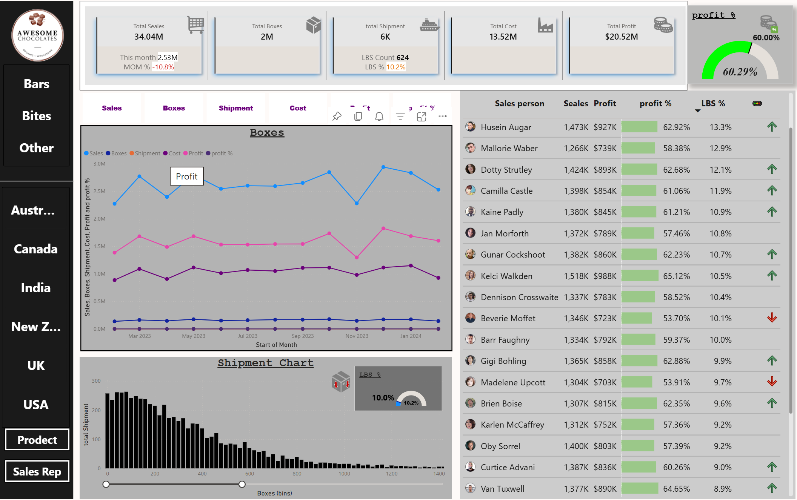
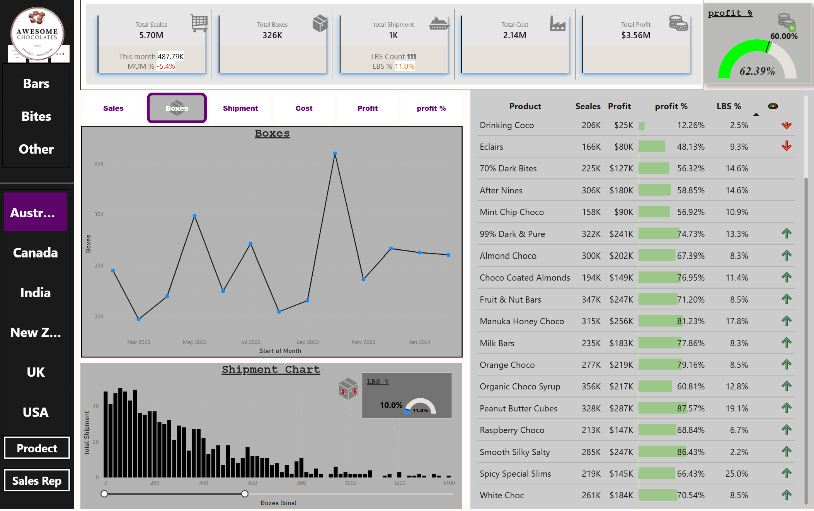
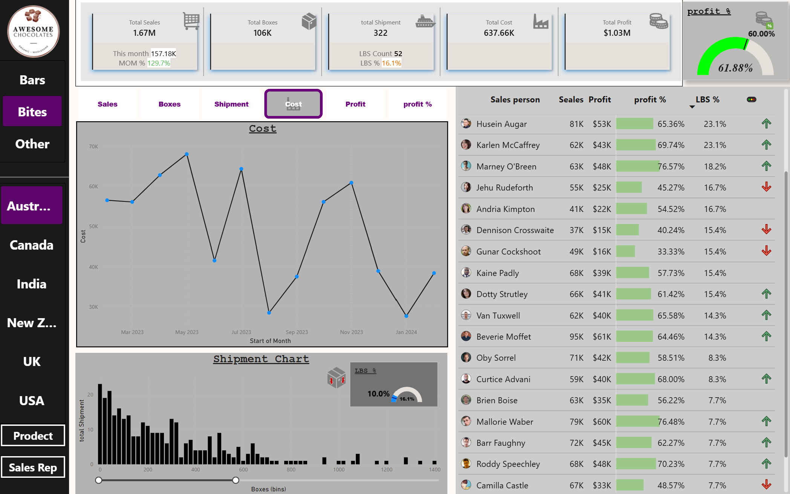
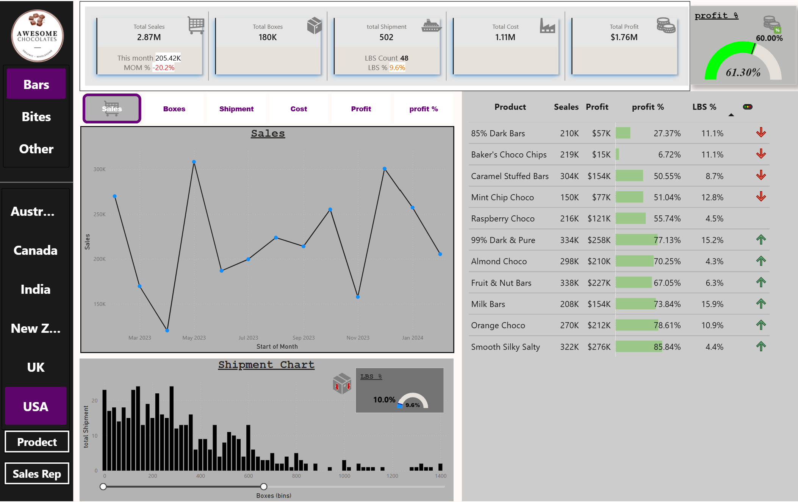
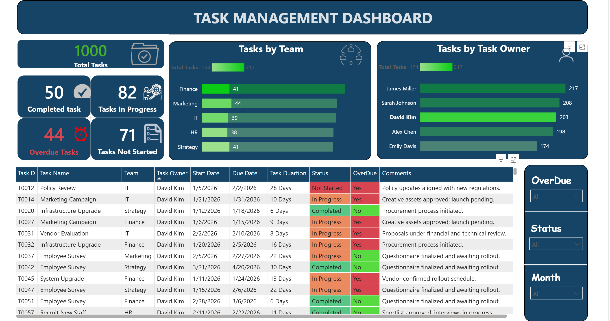
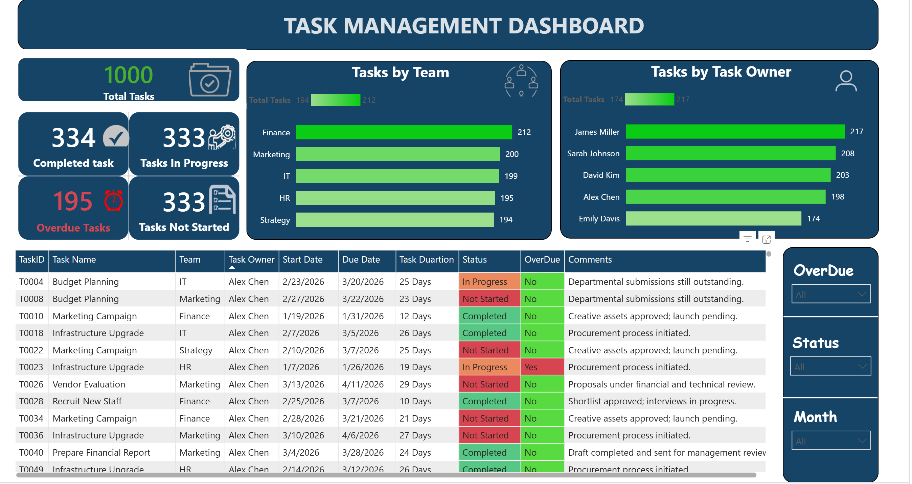
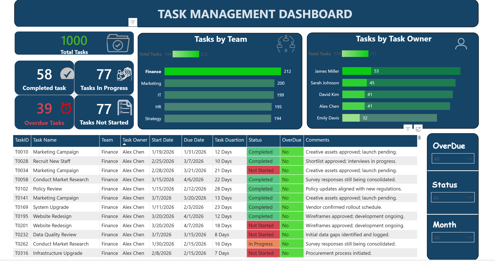

# Turki Aldalbahi

### Power BI | Business Analysis | Data Analytics | Project Management

PMP® Certified Project Manager with a background in Management Information Systems (MIS), with a focus on business analysis, project coordination, reporting, data analytics, and Power BI.

---

## 📊 Power BI Portfolio

Welcome to my Power BI portfolio.

This portfolio showcases self-developed training projects created to demonstrate practical skills in data analysis, business intelligence, dashboard development, and interactive reporting.

> **Note:** All projects are self-developed training projects created for learning and skills demonstration purposes. They are not client or employer deliverables.

---

## 🚀 Featured Projects

### 01 — Sales Analysis Dashboard

A Power BI dashboard designed to analyze sales performance, products, sales representatives, shipments, costs, and profitability across different markets.

**Key Features:**
- Sales and profit analysis
- Product performance analysis
- Sales representative performance
- Cost and shipment analysis
- Profit margin analysis
- Interactive filters by market and product
- Interactive Power BI dashboard

**Tools & Skills:**
`Microsoft Power BI` `Power Query` `DAX` `Data Modeling` `Data Visualization`

### Dashboard Preview

### 🔗 View Interactive Dashboard

[Open Sales Analysis Dashboard](https://app.powerbi.com/view?r=eyJrIjoiYjQ4Yzg4YzUtMDc3Zi00Y2M4LWI3ZDQtN2FhZTk4ZjFmMzdmIiwidCI6Ijc5MTAyMWJmLWYwZTUtNGQxMi1hYjJiLTg1OThmNzI4OTYxMiJ9)

---

### 02 — Task Management Dashboard

A Power BI dashboard designed to monitor task progress, team performance, task ownership, deadlines, and overdue activities.

**Key Features:**
- Total tasks overview
- Completed, In Progress, and Not Started tasks
- Overdue task tracking
- Tasks by team
- Tasks by task owner
- Task start date and due date
- Task duration analysis
- Interactive filters by status, overdue, and month
- Conditional formatting for task status and overdue tasks

**Tools & Skills:**
`Microsoft Power BI` `Power Query` `DAX` `Data Modeling` `Data Visualization`

### Dashboard Preview

### 🔗 View Interactive Dashboard

[Open Task Management Dashboard](https://app.powerbi.com/view?r=eyJrIjoiNWNkYzA4ZTctMTZmZi00OTBlLWFkZDMtNzQ4ODIzOGMwNmMxIiwidCI6Ijc5MTAyMWJmLWYwZTUtNGQxMi1hYjJiLTg1OThmNzI4OTYxMiJ9)

---

## 🛠️ Skills

- Microsoft Power BI
- Power Query
- DAX
- Data Modeling
- Data Visualization
- Business Analysis
- Data Analytics
- Project Management
- Project Coordination
- Reporting

---

## 📫 Contact

**LinkedIn:** [Turki Aldalbahi](https://www.linkedin.com/in/turki-alotaibiii-/)

**Email:** [T.alotaiibi@gmail.com](mailto:T.alotaiibi@gmail.com)
